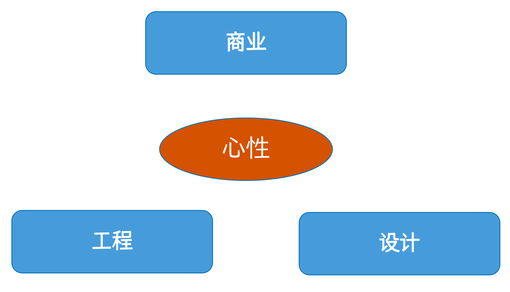

# 许式伟聊 AI 时代下的工程师发展观

"AI 是否在消灭工程师？"

这个问题从大模型爆发以来，一直是程序员圈子里讨论得沸沸扬扬的热门话题。Cursor、Claude Code、Kiro 等 AI 编程工具的出现，让写代码这件事变得前所未有的简单。面对这样的"威胁"，不少工程师开始焦虑：我们是不是要被淘汰了？

这种焦虑其实不难理解。毕竟，写代码曾经看起来是软件工程师专属技能，如果连这个都被 AI 取代了，那我们还有什么价值？

在第四期 1024 实训营开营仪式上，实训营发起人许式伟（ https://github.com/xushiwei ）给出了他的洞察：**AI 并没有消灭工程师，反而让更多的人有了成为工程师的可能**。

这个观点与主流焦虑形成了鲜明对比，提供了一个全新的思考角度。

## 重新认识：什么是真正的工程能力？

要理解许式伟的观点，我们得先重新认识什么是真正的工程能力。

### 工程：不只是写代码，而是"把事做成"

许式伟说，工程本质上是一门关于如何"把事做成"的学问。这个定义听起来很简单，但内涵很深刻。

工程不是某个特定的专业或行业，而是可以与所有学科交叉的通用能力。从造房子到软件开发，从航天工程到 AI 应用，所有领域都离不开工程思维。

许式伟甚至提出了一个前瞻性的观点：**未来所有的工程都是软件工程**。这个观点听起来有些激进，但如果你仔细观察，会发现软件正在渗透到各个传统行业。从汽车到建筑，从医疗到农业，软件正在成为所有工程的基础。

而工程的核心要素包括三个：

**模块化**：把复杂问题拆解成独立的子问题。就像搭积木一样，先分解，再组装。

**版本迭代**：通过迭代的方式逼近目标，控制做事的节奏。不是一次性做完，而是分步骤，每个版本都有价值。

**团队分工**：处理能力复杂性和时间复杂性。一个人做不完的事情，需要团队协作。

### 设计：不是包装，而是决策

与工程紧密相关的是设计能力。但这里的设计不是指 UI 设计或包装，而是一门关于"决策"的学问。

设计要回答的核心问题是：要做什么事，以及把事做成什么样子。无论是组织设计、产品设计还是架构设计，本质上都是在做决策。

许式伟说，做决策最难的不是决定做什么，而是决定不做什么。什么都想做，往往什么都做不好。

### 人的能力象限：工程师的成长地图

许式伟提出了一个很有意思的模型——人的能力象限，包括四个维度：

在这个模型中，工程和设计是基础能力，而商业和心性则是让工程师走得更远的关键。为什么要在这四个维度发展？因为真正想成事的人往往都需要这些综合能力——不仅要能解决工程问题，还要能理解商业需求，更要能在复杂环境中保持定力。在过去，每个维度要想做好，都需要花费大量的精力。而现在 AI 的出现，恰恰能帮助我们更好地发展这些能力，让工程师能够更专注于决策和创造。所以说 AI 其实是工程师成长的加速器，我们应该更加主动地拥抱 AI。

## AI 时代的工程变革：门槛降低，天花板提升

### AI 让工程能力"飞入寻常百姓家"

AI 的出现让软件工程变得无处不在。许式伟用了一个很生动的比喻：就像 iOS 让 3 岁小孩都能玩电脑一样，AI 让更多人可以参与到软件开发中来。

这种门槛降低是历史发展的必然。IT 技术的普及一直在发生，只是之前主要影响的是用户，现在开始影响开发者（Builder）。

### AI 提升了工程的天花板

这里有个有趣的现象：虽然 AI 降低了入门门槛，但它同时提高了专业工程师的门槛。

许式伟说，写代码从来都不是专业工程师最关键的能力，AI 让所有人都清楚地看到了这一点。当 AI 能够生成代码时，工程师的价值就更多地体现在其他地方了。

AI 时代要求工程师具备更综合的能力：

- 从写代码转向做决策
- 从专业分工转向综合能力
- 从工业化思维转向 AI 时代思维

许式伟举了个例子：自动驾驶这样的复杂工程，纯靠工程师手写逻辑代码是实现不了的，必须借助 AI 技术。

这意味着工程师需要学会与 AI 协作，而不是试图替代 AI。

更重要的是，AI 不仅没有消灭工程师，反而提升了工程的天花板。它让工程师能够处理更复杂的问题，实现更宏大的目标。

## 工程师的发展方向：成为超级个体

AI 可以生成代码，但无法替代人类的判断和决策能力。

这种变化背后是时代逻辑的根本转变。工业化时代产生了精细分工，每个人只需要掌握一个领域的技能，就像流水线上的工人一样。但 AI 时代打破了这种分工模式，要求每个人都能成为"超级个体"。

许式伟说，这种转变不是偶然的。当 AI 能够处理大部分技术细节时，工程师的价值就更多地体现在综合判断和决策能力上。工业化时代要的是专业分工，但 AI 时代要的是超级个体。这对今天的教育产生了巨大挑战，因为传统的专业教育模式已经无法满足 AI 时代的需求。

## 1024 实训营：成就优秀工程师

秉持着这些理念，1024 实训营致力于成就优秀工程师，为工程师的职业发展提供助力。

1024 实训营的目标是助力大学生职业发展，缩短从校园到企业的距离。但它的核心目标不是教授技术技能，而是让学生通过实践理解"什么是工程，如何做工程"。进阶目标是让学生理解"产品设计"与"架构设计"的基础逻辑。这些能力在 AI 时代比具体的技术技能更重要。

AI 时代不是工程师的末日，而是工程师的新起点。

在 1024 实训营，我们致力于培养这样的工程师——他们不仅掌握技术，更具备工程思维；他们不仅会写代码，更会做决策；他们不仅适应 AI 时代，更能在 AI 时代中脱颖而出。

让我们一起努力。
