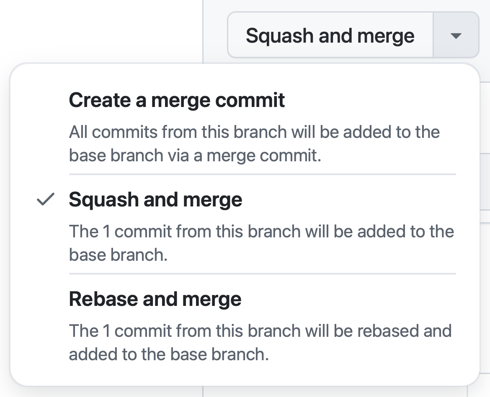

# GitHub PR 合并三选一：主分支该怎么选？

> 
>
> 在每个 PR 的底部，GitHub 都会给出三个合并选择。大多数开发者会习惯性地点击默认选项，但这个看似简单的决定却深刻影响着项目历史。
>
> 今天我们来聊聊：为什么这个选择如此重要，以及为什么我坚持只用其中的一个。

## TL;DR

**对指向主分支的 PR，一律选择 `Squash and merge`。**

配合 [rulesets](https://docs.github.com/en/repositories/configuring-branches-and-merges-in-your-repository/managing-rulesets/about-rulesets) 开启 [`Require linear history`](https://docs.github.com/en/repositories/configuring-branches-and-merges-in-your-repository/managing-rulesets/available-rules-for-rulesets#require-linear-history)，把线性历史与回滚边界制度化，从源头避免误操作。

## 核心原则：one PR, one commit

**一个 PR 最终只对应主分支上的一个 commit。**

PR 内部发生的多个 commits 都是开发阶段的中间态。历史被合并进主分支的那一刻，维护者更关心“结果”，也就是合并时那个版本的变更。需要更细的过程与讨论，可以通过 commit message 中的 PR 链接进入 PR 页面回看所有细节。

这个原则与 GitHub 的 `Squash and merge` 天然契合：一件事，一个节点，边界清晰。

## 三种方式全面对比

| 维度 | Create a merge commit | Rebase and merge | Squash and merge |
|------|-----------------------|------------------|------------------|
| **历史结构** | 产生 merge commit，主分支出现分叉 | 把 PR 的每个 commit 接到主分支，历史线性 | 把整个 PR 压成一个 commit 进入主分支，历史线性 |
| **协作影响** | 图谱更杂，阅读与 bisect 成本上升 | 改写 commit hashes，评论锚点与外部引用容易受影响 | 主分支整洁，release notes 更直观，审计与回滚成本更低 |
| **代码审计** | 需要追踪分支拓扑，复杂度高 | Commit hash 变化影响引用 | 线性历史，一目了然 |
| **版本回滚** | `git revert -m` 回滚合并节点，语义复杂 | 可逐条或成组回滚 | `git revert <squash_hash>` 一键整块撤回 |
| **Git bisect** | 在合并点容易困惑 | 可能命中中间态 | 每个 commit 都是完整功能态 |
| **生成 changelog** | 混合修修补补的小 commits | 同样包含中间 commits | 直接基于 PR 生成，语义清晰 |

**本文主张**：主分支只接受 `Squash and merge`。

## 为什么选择 `Squash and merge`

基于上面的对比分析，`Squash and merge` 的核心优势在于：
- **历史整洁**：线性历史，加上一个 PR 一个 commit，主分支成为清晰的时间轴
- **操作简单**：回滚用 `git revert <squash_hash>`，发布用 PR 生成 changelog，边界明确
- **协作友好**：避免已存在 commit 的 hash 被重写，保持评论和审计完整性

这些优势让 `Squash and merge` 成为团队协作的最佳选择。

## 潜在担忧与应对

### 信息粒度损失

Squash 会丢失分支内的细粒度 commits。

**解决方案**：在合并对话框里写好一条高质量的 commit message，正文包含动机、设计取舍、风险与兼容性影响、迁移指引，并保留 `Co-authored-by`。细粒度历史保存在 PR 页面，随时可溯源。

### 复杂功能的开发过程追踪

对于包含多个开发阶段的复杂功能，有些团队希望保留详细的开发轨迹。

**解决方案**：建议将复杂功能拆分成多个独立 PR。如需保留内部开发结构，可在长期功能分支或发布分支间使用 merge commit，主分支仍用 squash 保持整洁。

## 配置指南

### 个人项目配置

如果是项目 owner，可以直接在仓库设置中限制合并方式：
1. 进入仓库的 `Settings -> General -> Pull Requests`
2. 勾选 `Allow squash merging`
3. 取消 `Allow merge commits`
4. 取消 `Allow rebase merging`

### 团队项目强制约束

对于团队协作，建议使用 rulesets 进行强制约束：
1. **创建分支保护规则**
   - 进入仓库的 `Settings -> Rules -> Rulesets -> New branch ruleset`
   - 勾选 `Require linear history` 强制线性历史
2. **应用到目标分支**
   - 将创建的规则应用到主分支或使用匹配模式覆盖多个分支

### Commit message 编写规范

- **标题**：使用 PR 标题，简洁描述变更内容
- **正文**：详细说明变更动机、技术方案、潜在风险和迁移指引
- **溯源信息**：保留 PR 链接和 `Co-authored-by` 列表，便于追溯
- **格式约定**：如团队使用 [Conventional Commits](https://www.conventionalcommits.org/en/v1.0.0/)，请遵循相应格式

### 问题回滚方案

- **图形界面**：在 PR 页面点击 `Revert` 按钮，自动生成回滚 PR
- **命令行操作**：执行 `git revert <squash_hash>`，然后创建新 PR 提交回滚

## 常见问题与解决方案

### Q：为什么不选择同样线性的 `Rebase and merge`？

**A**：Rebase 会在合并时改写 commit hashes，容易打断评论锚点、外部引用和审计链。将 rebase 的复杂性留在分支阶段更稳妥，主分支只接受最终结果。

### Q：`Squash and merge` 会丢失贡献者信息吗？

**A**：不会。在合并对话框中使用 `Co-authored-by` 即可保留所有贡献者信息，PR 页面也会完整保存讨论记录和检查结果。

### Q：现有项目已有很多 merge commits，如何迁移？

**A**：新规则只影响未来的 commits。建议先为主分支启用 ruleset，在新 PR 中采用 squash，不要重写已有历史以免影响协作。

### Q：团队成员习惯了 `Create a merge commit`，怎么推动改变？

**A**：建议分步推进：
1. 分享线性历史的好处和实际案例
2. 先在新项目中试验 squash-only 策略
3. 为现有项目设定一个切换时间点，提前通知所有成员

## 今天就行动起来

**主分支是团队的时间轴，让它保持清晰。**

复杂的开发过程留在分支中讨论，最终的成果用一个明确的 commit 记录在主分支上。这不仅是技术规范，更是对未来维护者的尊重。

现在就打开你的项目设置页面，将合并方式调整为 squash-only，你的团队（和未来的自己）会感谢你。

**记住：one PR, one commit. Keep master clean.**
