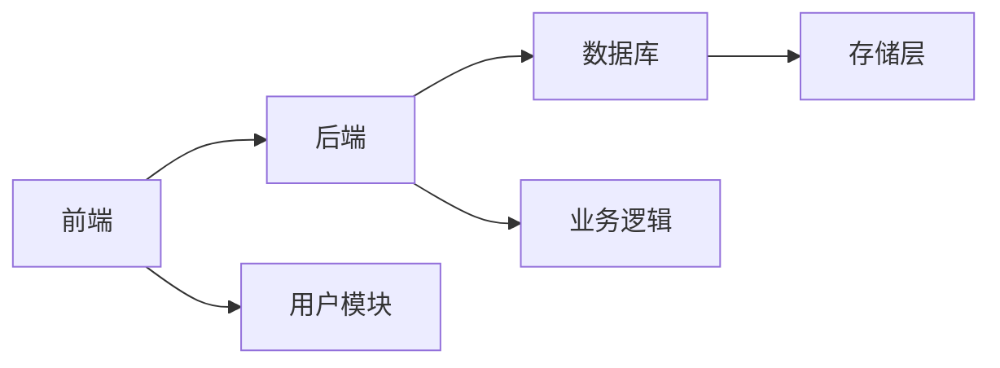

# 关于架构设计的几点认知体会

架构设计，在很多人眼里是个高大上的话题。

一提到架构，很多人脑海中浮现的可能是高并发、高可用、微服务、分布式这些听起来就很"技术"的词汇。似乎只有那些处理海量数据、支撑千万用户的系统才需要做架构设计，而日常的业务开发，就是按需求写代码，哪里需要什么架构？

恰恰相反，在我看来，这种认知是对架构设计的误解。不管是啥项目，要想把它做好，其实都需要一定的架构设计。架构设计也没那么神秘，我们不需要奢望一步到位，也不必追求“终极方案”，只需要围绕业务目标做好拆分，把边界划清、把职责理顺，其实就是好架构的起点。

那到底该如何做架构设计呢？

实训营导师和不少行业大咖都有一些见解，建议大家参考：

- https://mp.weixin.qq.com/s/_EL42S5K4CCaGjoc66e-eg
- https://mp.weixin.qq.com/s/8lRE6bfWAj8fdUe_5q32Pw

我这里也想聊聊我的一些发现和认知。

## 架构设计不光是个技术问题，也是个协作问题

在过去，你一个人写的项目，可能确实不需要做架构设计，起码不一定需要写成专门的架构设计文档。一个人的项目，边界和接口都在你脑子里，想怎么改就怎么改，出了问题也是自己承担。

但在企业里不同，很少有单打独斗的场景。即使是小团队的项目，通常也需要前后端协作。这时候，如果没有清晰的架构设计，可能就会有问题：

- **边界不清**：你理解的"用户模块"和我理解的可能完全不一样，到底包含哪些功能？
- **接口混乱**：今天你返回一个对象，明天我需要一个数组，后天又要加个字段
- **集成困难**：各自开发时都没问题，一合并就到处报错
- **维护灾难**：过了几个月，谁都不记得当初为什么要这么写

更重要的是，在当下的 AI 时代，这个问题将更加突出。即便是当前最优秀的模型（如 Claude），如果缺乏必要的约束与预先设计，也会经常产出"屎山代码"，"粘合代码"，长期积累不仅无法提质增效，反而会带来维护成本攀升与演进受阻的风险。

所以，我们特别建议，大家编码前要先做架构设计，这也是我们 1024 实训营倡导的规范。

## 方框图不是架构设计，起码不应该是架构表达的重点

这点，我发现很多同学可能没意识到。

在实训营项目路演时，尤其在早期，我们希望通过 "你做我看" 的形式让同学们真切体会到做生产级项目可能遇到的问题。

然而，每一届同学在讲架构的时候，都会有同学拿方框图来聊。

类似这种:

实际上我挺不推荐用方框图来表达架构的，起码它不应该作为架构表达的重点。因为方框图的信息密度太低、约束性太小，并不适合作为团队内部协作。甚至在我看来，方框图本质是给“外人”看的，给不需要深度参与本项目的人看的。与其花精力用 PPT 做这种图，不如手画来得利索。

## 架构设计要紧贴产品，不能本末倒置

架构不是为技术堆料，而是为产品结果服务。不同的产品方向，会导致实现差异很大。所以做架构前，一定要讨论清楚产品方向，最好要有完善的 PRD，即使没有，那也要搞清楚用户故事。

第四期 1024 实训营就有个议题是智能运维项目，而这个智能运维项目到底是做成旁路的观察者角色，还是带运维动作的智能平台，很明显差别很大。团队早期就在这个地方花了很多精力来讨论、对齐，这是非常有必要的。

另外，我看 XGo 用户群里就有人戏说 ”架构最大的敌人是销售“、 ”销售觉得对他最大的制肘就是技术“、”产品没做出来之前，技术都是宝宝，做出来之后都是牛夫人“，都是挺有意思的言论，可见离开产品聊技术本身就是不行的。

## 关键技术决策很重要，值得花大精力

要什么、不要什么，这很重要。每一项重大决策都应该是有缘由的，不能拍脑袋。

太阳底下，没有新鲜事。尤其现在，互联网上资源这么丰富，大家面临的绝大部分场景都是工程问题，鲜少有“你面临的问题就是独一无二的”这种情况。在这种情况下，在架构设计的早期（通常是概要设计阶段），就应该尽可能充分调研、尝试、比较，把不确定的问题尽早确定，不要闭门造车。

比如数据库选型，是选择关系型数据库还是非关系型，是选择时序数据库还是要上数仓？协议是用 REST API 还是用 gRPC？部署形态是物理机还是选择云原生集群？关键库，比如要做编辑器，是用 Tiptap 还是 Monaco？等等，不同项目考虑的点也会不同。

不过，通常能上升到关键技术决策的，都是可能影响项目成败的关键因素，是值得花大精力来对待的。

## 最好的详细设计，是直接用代码串起核心流程

当大的方向确定之后，我们通常会来到详细设计环节。在这个环节我们需要做好模块拆分、边界定义以及关键实体的设计。

这个环节其实比较考验编码能力。如何把复杂问题拆解成独立子问题、什么样的模块和边界最合适且更优雅，都需要权衡。而且有时候选择也不唯一。

但没关系，作为工程师我们本身这块就需要不断练习的，多想、多看、多试就好了。尤其是大家日常可以多看看一些有名的开源项目，若能参与其中本身也是很好的历练。

另外，现在在 AI 加持下，详细设计可以不仅仅局限在文档上，我们完全可以在设计的同时，通过 AI 将核心流程实现并串起来，这样才更有说服力。

毕竟，文档再严谨，也不如一段能编译运行的代码更经得起检验。你说呢？

## 最后

在我看来，架构设计是一门偏实战的学问，比较难以言传的，不过它确实对工程师发展来说很关键。

正因为如此，在 1024 实训营中，我们把架构设计作为我们重点传递和布道的能力。我们希望同学们在职场的初期，就能建立架构的感觉，形成良好的做事习惯，也能为大家以后的职业发展形成助力。
