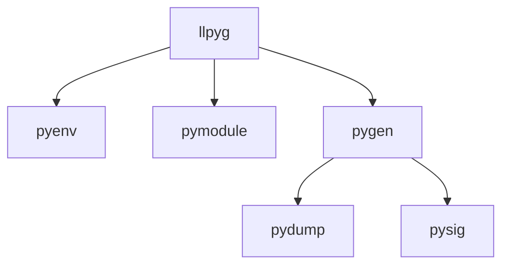

# llpyg: LLGo 快速集成 Python 生态的桥梁

## 前言

[LLGo](https://github.com/goplus/llgo) 是一款基于 LLVM 的 Go 编译器，通过 LLVM 为 Go 语言整合了 C 和 Python 语言生态，让开发者可以更工程化地在 Go 中使用海量的 Python 生态库，比如直接使用 numpy、torch 等库。

要实现在 Go 中使用 Python 库，需要有对应的 LLGo Bindings 代码，才能通过 LLGo 的二进制接口 (ABI) 调用 Python 库。生成一个 Python 库对应的接口代码，需要对库中定义的函数、类、变量等符号进行映射。但完全依赖人工的映射过程不仅效率低下，且极易引入难以察觉的错误。特别是当面对包含成百上千个 API 的大型 Python 库时，这种手动映射工作几乎成为不可能完成的任务。正是基于解决这一核心痛点的迫切需求，llpyg 自动化生成工具应运而生，旨在将这个耗时且易错的手动过程转变为高效、准确的自动化过程。

## 核心功能

### 符号提取

通过 Python 运行时反射机制，动态获取 Python 模块中的符号信息：
- 基于 CPython API，提取模块中的变量、函数、类等各类符号信息；
- 支持从文档注释中提取 C 扩展函数的签名信息；

### 签名解析

根据函数/方法的签名字符串，解析出所包含的参数信息：
- 支持解析可选参数、默认参数、位置参数、关键字参数等；
- 通过签名中的 `/` 和 `*` 等符号，对参数进行分组；

### 代码生成

在代码生成方面，llpyg：
- 支持函数、类、变量等 Python 对象的代码生成；
- 支持类继承、类方法、类属性等 Python 语言特性；
- 自动生成符合 Go 语言风格的函数、结构体和方法；

## 工作流程

llpyg 项目结构如下：


整体流程如下：
1. 执行 `pyenv`，设置 Python 路径，对环境进行检查；
2. 执行 `pymodule`，获取 Python 库的多级模块名，生成配置文件；
3. 逐模块执行 `pygen`，生成 LLGo Bindings 代码;

`pygen` 具体流程如下：
1. 执行 `pydump`，获取 Python 库的符号信息，包括函数、类等信息；
2. 执行 `pysig`，解析 Python 函数和方法签名；
3. 根据符号和签名信息使用工具 `gogen` 生成 Go 代码；


## 符号映射

在 llpyg 中，我们使用通用类型 `py.Object` 来表示 Python 对象。每一个 Python 对象都可以被映射为 `py.Object` 类型。
```go
type Object struct {
	Unused [8]byte
}
```
为了提供对于 Python 类的支持，我们使用结构体来表示 Python 类，通过结构体嵌入实现类似继承的效果：
```go
type Animal struct {
	py.Object
}

type Dog struct {
	Animal
}
```
针对每一个 Python 类，我们提供了一个构造函数 `New[ClassName]` 用于创建实例：
```go
//go:linkname NewAnimal py.Animal
func NewAnimal(name *py.Object) *Animal
```
对于类方法和实例方法，我们使用结构体方法来表示：
```go
//llgo:link (*Dog).Run py.Dog.run
func (*Dog) Run() *py.Object {
	return nil
}
```
对于类实例中存在的属性，我们将其拆分为了 `get` 和 `set` 方法：
```go
//llgo:link (*Dog).Age py.Dog.age.__get__
func (*Dog) Age() *py.Object {
	return nil
}

//llgo:link (*Dog).SetAge py.Dog.age.__set__
func (*Dog) SetAge(age *py.Object) {
}
```

## 运行示例

接下来，我们以 numpy 库为例，展示 llpyg 的使用方法。

### 程序输入
用户可以通过以下命令一键生成 numpy 库的 LLGo Bindings 代码：
```bash
llpyg numpy
```
同时支持在命令中添加以下参数：
- `-o`: 指定 LLGo Bindings 代码的输出目录
- `-mod`: 为生成的 LLGo Bindings 初始化为 Go Module
- `-d`: 期望转换的 Python 库的模块的最大深度

用户还可以通过配置文件的方式来生成 LLGo Bindings 代码：
```bash
llpyg llpyg.cfg
```
配置文件示例如下：
```json
{
  "name": "numpy",
  "libName": "numpy",
  "modules": [
    "numpy",
    "numpy.random"
  ]
}
```
- `name`: 生成的 Go Package 名称
- `libName`: 要转换的 Python 库名称
- `modules`: 要转换的 Python 库的模块

### 输出结果

llpyg 会将生成的代码组织为一个 Go Module，结构如下：
```text
numpy
├── numpy.go    // 主模块 LLGo Bindings 文件
├── random
│   └── random.go    // 子模块 LLGo Bindings 文件
├── go.mod
├── go.sum
└── llpyg.cfg    // 配置文件
```
Go 文件中存放 Python 模块对应的 LLGo Bindings 代码。例如，对于 `numpy.add` 函数：
```Python
numpy.add(x1, x2)
```
llpyg 生成的 LLGo Binding 为：
```go
//go:linkname Add py.add
func Add(x1 *py.Object, x2 *py.Object) *py.Object
```

### 使用示例

用户可以像使用 Go 函数一样使用 Python 函数：
```go
import (
	"github.com/goplus/lib/py"
	"github.com/goplus/lib/py/std"
	"github.com/goplus/llpyg/numpy"
)

func main() {
	a := py.List(1, 2, 3)
	b := py.List(4, 5, 6)
	res := numpy.Add(a, b)
	std.Print(py.Str("a+b ="), res)
}
```
输出：
```text
a+b = [5 7 9]
```

## 未来发展

llpyg 正致力于扩展其功能，包括：
- 支持更多 Python 语言特性，如装饰器、生成器等；
- 实现更精确的类型推断和转换；
- 逐步探索 Python 生态中复杂库的生成能力。

通过持续优化，llpyg 将为 LLGo 开发者提供更高效、更可靠的 Python 库绑定生成工具，进一步推动 Go 和 Python 生态的融合。

