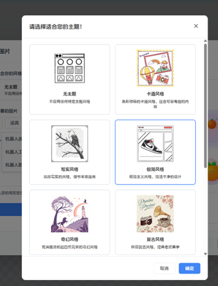
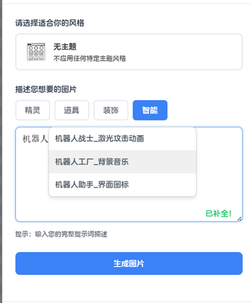

**X绘图-我们是如何让AI更好的融入我们的产品的**

**引言：**

> 笔者作为前端工程师，目前的工作主要是在为开源游戏平台XBuilder编写其精灵创作时的绘图功能。这个功能的基础是一个浏览器端编辑矢量图的功能。在此基础上，我们为其赋予了AI生成游戏素材的能力，让AI交互融入用户创作的过程中。

**序：**

> 我们正处于AI大模型落地的浪潮中。越来越多的应用都喜欢标榜"AI赋能""AI融入"。但是，很多应用和程序并没有很好的将AI"融入"他们的应用，而只是做了"引入"，一个按钮，一个接口，一个对话框；一个简单的引入API确实能带来AI对话的能力，但是这和真正的让AI提升工作效率和提升创作的上限是有着很大的差距的。本文将从交互逻辑，AI能力，Prompt构建等方向入手，聚焦于我们的实习团队的尝试，思路和努力，更好的在XBuilder的绘图功能中引入AI生图从而提升用户创作能力。

1.  **让AI交互融入交互逻辑**

作为前端开发者，我认为，时刻保持对用户交互逻辑的清晰认知是最为重要的事情。一切的功能都应该由用户的需求出发。我们不能为了"引入AI"这个目标，盲目的在应用里放一个按钮，放一个API调用的入口。AI的能力很强，但是也很宽泛。我们所做的就是让AI的能力迎合用户的需求，让其真正的解决用户的痛点。

XBuilder平台面向的用户主要是对游戏制作有热情的青少年人群。他们往往年轻，有创意，但是缺少美术的能力和技术。所以，绘图平台想要融入AI，就必须抓住他们的重点：用户创作图像的能力较差，构建提示词的能力较弱，但是他们对AI生成结果有一定的要求。

所以，我们基于这个用户画像出发，我们的AI功能应该要满足用户的需求。所以，我们主要提供了AI素材库，AI提示词构建，AI图像生成的功能。这些功能涵盖了一个完整的用户交互逻辑链条：

> 用户有想创作的游戏角色 -\> 用户构建提示词 -\> 提示词不断完善 -\>
> 最终生成用户满意的游戏素材

根据这一交互链路，我们构建了我们的AI素材生成体系。

2.  **AI模型的选择**

当前主流的大语言模型（如ChatGPT、Google Gemini等）虽然在通用任务上表现卓越，但在特定场景下的适用性仍需审慎评估。以图像生成为例，我们的需求并非传统的位图（如PNG格式）生成，而是高质量的矢量图（SVG）生成，二者在技术实现与应用逻辑上存在本质区别。

尽管通用大模型在位图生成方面能力出众，但在矢量图生成这一专业领域，却没有多少评测可供参考。为此，我们针对 OpenAI GPT-4、Claude、Google Gemini 2.0 Pro 以及专业绘图模型 Recraft v3/v2、SVGIO 等进行了专项测试。结果显示，通用大模型在矢量绘图任务上明显逊于专业模型，而 Recraft 在输出质量与格式支持方面更贴合我们的需求，因此最终选定其作为主要图像生成方案。

值得反思的是，当前不少业务在技术选型时盲目追求通用大模型或对话式交互，某种程度上反映出在用户需求洞察与产品设计上的简化思维。优秀的产品应当始终以用户真实需求为核心，每一项功能的引入，都应回归到本质问题：它是否真正解决了用户的痛点？

3. **Prompt构建体系**

对于AI生成效果而言，Prompt的质量是非常重要的。业界有一句俗语，"Garbage in, garbage out."。我们的产品如果要优秀的生成效果，那就必须有优秀的Prompt。但是对我们的用户画像而言，用户自身构建提示词的能力其实是不强的。青少年儿童，特别是有创作游戏热情的儿童，我们对他们的语言描述能力是不做很高的预期的。所以，我们必须降低用户创建提示词的门槛，同时也要在用户看不到的地方进一步的提升提示词的质量，从而让大模型得到质量更高的提示词。

**3.1交互上的努力**

**3.1.1风格选择**

对于输出的图片而言，不同的风格得到的结果是截然不同的。于是，我们用风格选择器，帮助用户选择他们更预期的风格。这样的风格选择是基于图片的，而不仅仅是文字的，这样可以显著的降低门槛。同时，风格信息对于输出预期的提升是非常显著的。

**3.1.2提示词**

我们构建了类IDE模式的提示词补全体系。我们预期的用户输入是简单的，基础的。对于一个6岁的孩子而言，他可能只能输出1-2个单词，你不可能指望孩子输出规范而详细的提示词。于是，我们在输入框中引入了补全体系。这个补全系统会根据用户的项目信息，结合小型大语言模型，对提示词进行强化和补全，从而在用户输入的过程动态的获取到更强大，规范，详细的提示词。

这是我们交互上的一个例子，我们可以看到，基于简单的用户输入，可以得到风格，样式，动作等多维度的提示，用户可以选择他预期的帮助，也可以继续自由输入。我们会不断地帮助用户构建他更想要的东西。

**3.1.2即时图片反馈**

我们维护了一个庞大的AI素材库，我们所有AI生成的照片都会保存到库中。在我们输入提示词的过程中，随着补全，也会调用即时搜索的接口。这样，用户相当于能获得文字+图片的双重反馈。一方面，用户可以根据图片的反馈修改自己的提示词，另一方面，如果用户直接选择了素材库中的结果，也就节省了一次生成图片的调用成本。

**3.2 用户看不见的努力**

我们在前端交互上致力于降低用户的输入门槛，但这仅仅是"冰山一角"。当用户的原始提示词，哪怕只是"一只猫"这样简单的短语，被传递到后端时，我们的系统会立即启动一套精密且多层次的自动化增强流程。这套流程的核心目的，就是将用户朴素、口语化的表达，翻译成AI绘图模型能够精准理解和高效执行的"专业指令"。

这个过程主要分为三个阶段：智能分析、分层优化和上下文融合。

**第一步：智能分析与"诊断"**

系统首先会对用户输入的原始提示词进行一次快速的"诊断"。我们利用AI对提示词进行多维度分析，精准地理解其核心意图：

-   **内容类型分析
    (Type)**：判断用户想画的是动物、人物、场景还是其他具体事物。这决定了后续增强的基础方向。

-   **情感风格分析
    (Emotion)**：解析用户可能蕴含的情感倾向，比如是想要"可爱"的风格，还是"炫酷"的风格。

-   **复杂度分析
    (Complexity)**：评估用户描述的复杂程度。一个词的提示词（如"龙"）和一句话的提示词（如"一条在城堡上空喷火的龙"）所需要的增强策略是截然不同的。

这次诊断为后续的"对症下药"提供了精准的依据，确保增强的方向符合用户的初步设想。

**第二步：四层"处方"式优化**

在完成分析后，系统会像开具处方一样，对提示词进行四层叠加式的强化，每一层都为最终的生成效果添砖加瓦：

1.  **主题增强 (Theme
    Enhancement)**：首先，结合用户在界面上选择的视觉风格（如"卡通风"），系统会将风格转化为具体的、描述性的语言。例如，原始的"一只小猫"会在这里被扩充为"一只小猫，采用卡通风格，色彩鲜艳丰富，造型可爱有趣"。

2.  **质量增强 (Quality
    Enhancement)**：接着，根据第一步分析出的复杂度，系统会自动附加相应的质量要求。对于简单的提示词，我们会加上"高质量矢量图，线条清晰"；而对于复杂的创作，则会提升至"精致细节，专业插画，复杂设计"等专业级别要求，确保输出结果的下限。

3.  **样式增强 (Style
    Enhancement)**：然后，依据内容类型，系统会注入更具象的风格描述。如果画的是"动物"，就会补充"造型可爱友好"；如果画的是"场景"，则会强调"氛围感强，环境细节丰富"，让生成的内容更具表现力。

4.  **技术要求 (Technical
    Requirements)**：最后，也是至关重要的一步，我们会附加针对矢量图（SVG）格式的技术性指令，如"SVG矢量格式，几何形状简单，元素分离清晰，适合游戏资源"。这确保了AI生成的不仅是一张"图"，更是一个符合我们平台技术规范、便于用户后续编辑和使用的"资源"。

经过这四层优化，一个原本简单的用户输入已经被构建成一个结构完整、细节丰富、兼具艺术性与技术性的高质量Prompt。

**第三步：融合项目上下文的"个性化"**

我们的增强不止于此。为了让AI生成的内容能更好地服务于用户的整体创作，系统还会智能提取用户当前项目中的关键信息（如项目名称、简介中的关键词）。例如，如果用户的项目是一个关于"森林冒险"的游戏，当他输入"背景图片"时，系统会自动将项目关键词融入提示词，最终形成如"背景图片,
相关元素: 森林, 冒险, 魔法, 精灵,
城堡"这样的指令。这使得AI的每一次生成都与用户的创作主题紧密相连，成为其游戏世界的一部分，而非一次孤立的绘图。

总而言之，在用户看不见的后端，我们通过一套自动化的分析、优化和融合流程，为用户的创意搭建了一座坚实的桥梁。这座桥梁跨越了从"朴素想法"到"专业指令"的鸿沟，让即便是毫无美术和AI使用经验的青少年，也能轻松驾驭强大的AI生产力，将心中的奇思妙想变为高质量的游戏素材。这正是我们将AI"融入"产品，而非简单"引入"的核心体现。

4. **总结与展望**

回顾我们在 XBuilder 绘图功能中融合 AI 的探索历程，我们深刻地体会到，AI与产品的深度融合，绝非简单地在界面上增加一个功能按钮，而是要将AI能力作为一种底层支持，无缝地嵌入到用户自然创作的每一个环节中。

我们的核心思路，是构建一套从前端交互到后端赋能的完整闭环。在用户看得见的地方，我们通过风格选择器、IDE 式的提示词补全和即时图片反馈等交互设计，最大限度地降低了青少年用户的创作门槛，引导他们更清晰地表达自己的创意。而在用户看不见的地方，我们通过智能分析、多层优化和上下文融合的自动化 Prompt 增强体系，将用户最朴素的想法"翻译"和"拔高"为专业级的创作指令，确保了最终输出的质量和相关性。

这套"表里结合"的方案，让我们成功地将强大的 AI 生图能力，转化为了用户手中易于驾驭的创作工具。它解决了我们目标用户"有创意，但缺乏实现能力"的核心痛点，真正做到了让技术为人服务。

展望未来，尽管 AI 技术持续演进，我们始终坚持以用户为中心的产品哲学。在 AI 时代，优秀的设计应让复杂技术退居幕后，使用户的创意与思想成为真正的主角。未来的挑战将不再局限于提升模型能力或叠加功能，而更在于深入理解用户需求，以更自然、无感的方式将 AI 转化为用户创造力的延伸。因此，最具价值的 AI 产品，必是那些真正以人为本、将技术融于无形体验的产品，这也是我们团队持续努力的方向。
